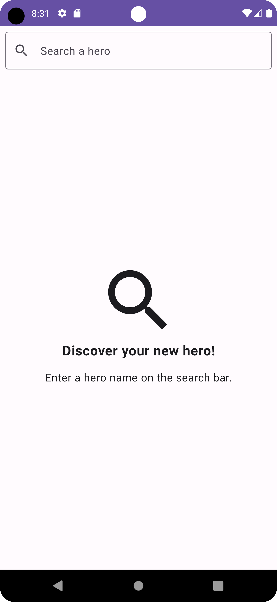
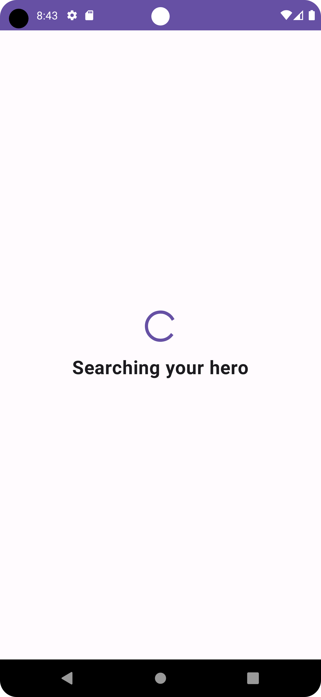
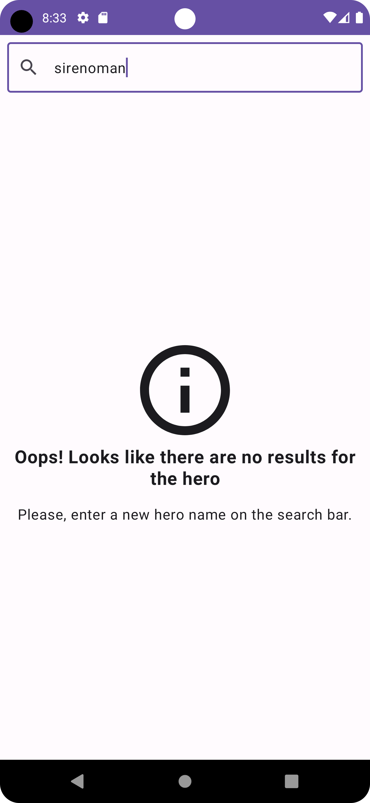
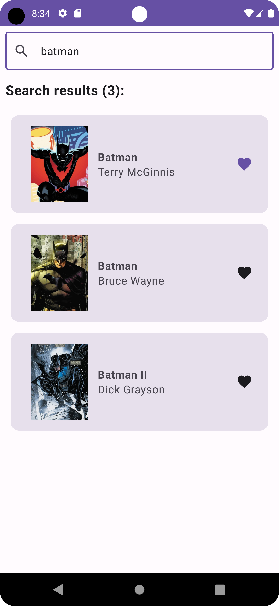
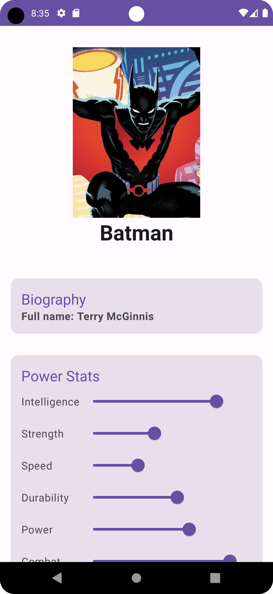
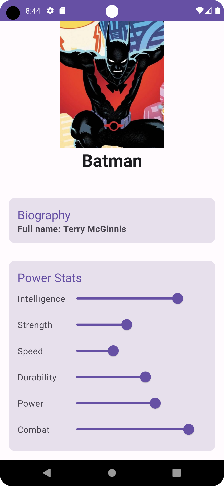

 

  

  <h3 align="center">Hero Compose</h3>

  

    A demo app using Kotlin with Jetpack Compose. Fetching data from network and integrating persisted data in the database via repository pattern.
     
    <a href="https://github.com/aleiva17/heroes-compose-app/issues">Report Bug</a>
    ·
    <a href="https://github.com/aleiva17/heroes-compose-app/issues">Request Feature</a>
  

<!-- ABOUT THE PROJECT -->
## About The Project

  
  
  
  
  
  

### Dependencies

* Android Navigation
* Retrofit2
* Glide

<!-- CONTRIBUTING -->
## Contributing

Contributions are what make the open source community such an amazing place to learn, inspire, and create. Any contributions you make are **greatly appreciated**.

If you have a suggestion that would make this better, please fork the repo and create a pull request. You can also simply open an issue with the tag "enhancement".
Don't forget to give the project a star! Thanks again!

1. Fork the Project
2. Create your Feature Branch (`git checkout -b feature/AmazingFeature`)
3. Commit your Changes (`git commit -m 'feat: add some AmazingFeature'`)
4. Push to the Branch (`git push origin feature/AmazingFeature`)
5. Open a Pull Request

<!-- LICENSE -->
## License

Distributed under the MIT License. See `LICENSE.txt` for more information.

<!-- CONTACT -->
## Contact

Andrés Leiva - [@aleiva17](https://github.com/aleiva17) - aleiva1700@gmail.com
